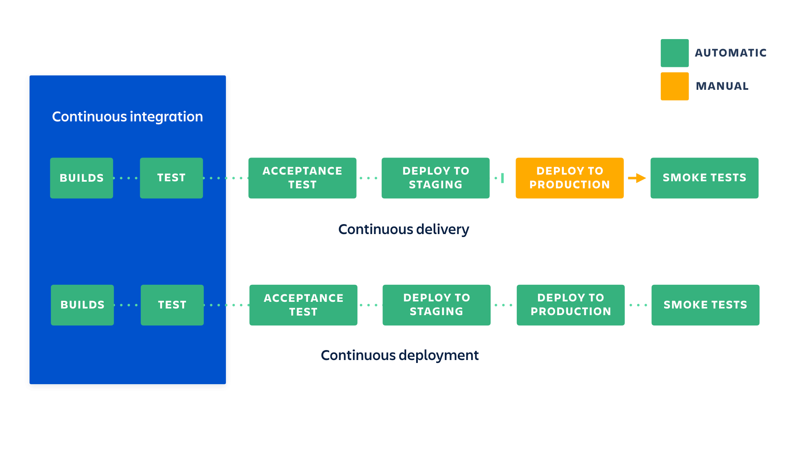

# Deployment Strategy for Web Apps

So you've finally built the thing but now you might be thinking to yourself, "How do I deploy this thing"? That question gets even more complicated when you throw in all the requirements of modern continuous integration and delivery. Complexity grows even more when coordination across people or full teams needs to be managed in your deployment strategy. In this post, I will outline one of my favorite deployment strategies that you can set up right away and still have it scale to multiple team members or even across a few teams.

## CI/CD

Continuous integration (CI) & continuous delivery/deployment (CD) are terms that are thrown around a lot when talking about deploying software. They describe the cycle of writing code, integrating that code into the codebase, usually with automation, and then deploying that code to an environment. Ideally, you want to make small, continuous improvements to your software and get those changes out to your users often and as fast as possible. CI/CD is a crucial system needed to meet this deployment goal. So what exactly is this system and how do we build it?

### Continuous Integration

Continuous integration, or CI, is the practice of integrating any and all code changes into the trunk or main branch of your code repository and then automating the testing, linting, style checks, and new build of those code changes. With this system in place, you can automatically detect errors and other issues that arise from your code changes much earlier in the development process. If you merge your changes often you also reduce the amount of code conflict that arises and this usually results in smaller pull requests and higher quality code reviews.

### Continuous Delivery

Continuous delivery, or CD, is the practice of automating infrastructure provisioning, packaging, and deployment of an application to a testing environment, usually after it goes through a CI layer. DevOps and DevEx teams usually gate this CD process with some requirements like code coverage must be over 80% or the Docker container must have no critical security warnings from a container scan for example. At the end of this process, the team should be able to deploy the software changes to production quickly and easily. Ideally this is done with a single button click after some manual testing and QA of the change in the test environment.

### Continuous Deployment

There is a second term for CD called continuous deployment. I like to think of continuous deployment as the more mature version of continuous delivery because this process automates the release and deployment of the changes into the production environment and into user's hands. If this is implemented correctly, a code change can be merged and then go live within a few minutes, allowing you to gather feedback and iterate quickly. Implementing continuous deployment does require more upfront investment, especially in your unit and end-to-end test suites, to ensure you do not accidentally push breaking changes to production.

The difference between continuous delivery and continuous deployment will be much more clear after our implementation. Atlassian has a great diagram showing the difference and how they relate to CI:



While you can have CI without CD, having CD without CI is generally not recommended as it is dangerous to release an untested application into production.

## Implementation

[TLDR; just show me the code](https://github.com/MarcusVirg/sandbox/tree/main/concepts/ci-cd-fe)

Now that we have a better idea of what some of these terms mean, let's go through an implementation of a CI/CD pipeline. This guide will not go through an implementation of continuous deployment as it can be implemented fairly easily after continuous integration and continuous delivery and is usually reserved for applications that have a robust controls in place. This guide will show a simple setup for doing a manual production release after continuous delivery. Unless you are one of those TDD tryhards that ship with a 99% code coverage test suite, I recommend you use a manual production release process until you have built up your own comprehensive test suite.

This guide will use an example front-end application and show you how to create a CI/CD process that deploys to [Vercel](https://vercel.com/home).

> Note: I am assuming you already have node installed and a development environment setup. If that isn't the case, please take time to do that now.

### Tools

There are many CI/CD tools out there that provide a platform to help integrate and deploy code changes. Some examples include:

- GitLab CI/CD
- GitHub Actions
- Jenkins
- CircleCI
- TravisCI
- Azure Pipelines
- and many more

They all have their pros and cons but I personally just go with GitHub actions and recommend you do the same. You are likely already using GitHub and they have a **very** generous free tier. The integration is better with your existing codebase and the community is already large so there is a ton of resources out there to learn about how it works. If you are using GitLab, I would recommend going with the GitLab CI/CD naturally.

If you work at a company, especially a large corporation, you likely have already had this decided for you. This guide should still be useful to you either way. You will either learn more about how your existing CI/CD works or will be able to take this GitHub actions example and duplicate the functionality in your tool of choice.

You will also need some tools adjacent to your CI/CD platform so you can actually build, test, and deploy your software. Your CI/CD won't do this for you, it simply runs tools to do all those things in an automated fashion.

Here are some examples of modern web build tools:

- [Webpack](https://webpack.js.org/)
- [Vite](https://vitejs.dev/)
- [Rollup](https://rollupjs.org/)
- [ESBuild](https://esbuild.github.io/)
- [Turborepo](https://turbo.build/)
- [Grunt](https://gruntjs.com/)
- [Parcel](https://parceljs.org/)

Here are some examples of modern web testing tools:

- [Jest](https://jestjs.io/)
- [Vitest](https://vitest.dev/)
- [Playwright](https://playwright.dev/)

Finally, here are some examples of modern web linting tools:

- [ESLint](https://eslint.org/)
- [TypeScript](https://www.typescriptlang.org/) (Typed JS, more than just a linter)
- [Prettier](https://prettier.io/) (Code Formatting)

In this guide, we will be using the following tools:

- Vite & Rollup for production bundling
- Vitest for testing
- ESLint & Prettier
- TypeScript

These tools will cover the building and testing of our application but what about deployment? We need some kind of system or platform that will take our final production bundle and serve those static files, or if we are using a server rendered application, a system that runs a node server. That system should also handle DNS for us and point a url at our application (ideally with SSL already setup). This is where Vercel comes in. They are a great platform for deploying static sites and SSR web applications. We will be using their CLI tool combined with GitHub Actions to deploy the application in the CD step.

### Setup

Let's quickly setup a React single page application using Vite so we have some project to test our CI/CD with.

> If you already have an existing project, please skip this step and go to [CI](#ci).

#### Vite CLI

Run:

```sh
npm create vite@latest
```

Enter a project name, select `React` as the framework, select `TypeScript` as the variant, and then hit enter to create the project. Following the instructions the CLI gives you and `cd` into your project folder and run `npm install`. This will install the dependencies you need to run a basic React app. Using the `Vite` CLI, we get some things for free. ESLint & TypeScript has already been installed and configured for us. To finish setup, we will just need to install and configure `Prettier` & `Vitest`.

#### Prettier

To setup Prettier, run:

```sh
npm install --save-dev prettier eslint-config-prettier
```

Add the prettier plugin to the eslint `extends` config that vite created for us in the `.eslintrc.cjs` file:

```js
extends: [
  'eslint:recommended',
  'plugin:@typescript-eslint/recommended',
  'plugin:react-hooks/recommended',
  'prettier'
],
```

Its also worth adding a `.prettierrc` to configure prettier to your liking here is an example:

```json
{
	"useTabs": true,
	"tabWidth": 2,
	"semi": false,
	"singleQuote": true,
	"trailingComma": "none",
	"printWidth": 100
}
```

Finally, change the `lint` command in `package.json` to `eslint . --ext ts,tsx --report-unused-disable-directives --max-warnings 0 && prettier --check src`.

This will run eslint and prettier in the CI later on.

> Make sure to run this command locally now and fix any errors otherwise it will break CI later on.

#### Vitest

To install `vitest` run:

```sh
npm install --save-dev vitest jsdom @testing-library/react @testing-library/jest-dom
```

Change your existing `vite.config.ts` file to be:

```ts
/// <reference types="vitest" />
import { defineConfig } from 'vite'
import react from '@vitejs/plugin-react'

// https://vitejs.dev/config/
export default defineConfig({
	plugins: [react()],
	test: {
		environment: 'jsdom',
		setupFiles: ['./setupTests.ts']
	}
})
```

Finally, create that `setupTests.ts` file in the root directory and paste this in:

```ts
import '@testing-library/jest-dom/vitest'
```

and add this file to your `tsconfig.json` `include` property:

```json
"include": ["src", "setupTests.ts"],
```

That should be all you need to setup vitest. Let's write a small sample test to have our CI run at least one test.

Create a new file called `App.test.tsx` in the `src` directory.

> Make sure the extensions is `.tsx` not `.ts`

Paste the following in the new file:

```tsx
import { describe, test, expect } from 'vitest'
import App from './App'
import { render, screen } from '@testing-library/react'

describe('App Render', () => {
	test('should render the app', () => {
		render(<App />)
		expect(screen.getByAltText('Vite logo')).toBeInTheDocument()
		expect(screen.getByAltText('React logo')).toBeInTheDocument()
	})
})
```

This test just renders our `App` component and checks if the logos were rendered.

Create a new `test` script in your `package.json` file:

```json
"test": "vitest --run",
```

Run `npm run test` locally to verify the test passes.

This concludes the setup and we can now move on to the actually CI/CD implementation.

### CI


