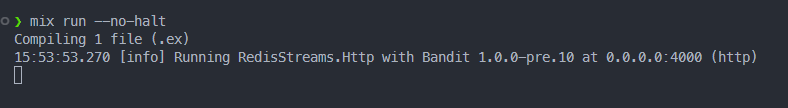

# Redis Streams With Elixir: A Guide to Event Sourcing

In the modern age of web applications, real-time data processing has become a crucial need to solve real-world problems while also delivering a great user experience.

As user interactions and events generate an ever-increasing flow of data, developers seek efficient solutions to handle, process, and deliver this stream of information in a timely manner. Combining the powerful concurrency model of Elixir with a battle-tested key-value database, Redis makes a great solution for a real-time event-sourcing system.

In this post, we will take a look at how to use Redis Streams in an Elixir application using web sockets. Afterwards, you should have a good starting point to build your own real-time system whether it be a chat application, monitoring system, or anything other system that could benefit from event sourcing.

[TLDR; just show me the code](https://github.com/MarcusVirg/sandbox/tree/main/concepts/redis-streams)

If you don't go through the tutorial, I recommend you at least read the [Caveats section](#caveats) for some important information.

## What are Redis Streams?

[Redis Streams](https://redis.io/docs/data-types/streams/) is a powerful data structure within Redis that allows you to store, manage, and process streams of data while keeping the elements in chronological order. The Redis docs give some good examples of use cases:

- Event sourcing (e.g., tracking user actions, clicks, etc.)
- Sensor monitoring (e.g., readings from devices in the field)
- Notifications (e.g., storing a record of each user's notifications in a separate stream)

If you are familiar with Kafka or RabbitMQ, Redis Streams are very similar to those projects but Redis Streams has some nice benefits. It is much simpler to set up and use vs. Kafka (no zookeeper thing) and you can easily create stateful storage for cross-stream data integrity/constraints. For now though will be focusing mainly on a simple implementation of the first example of tracking user actions in our app.

It is important to know that streams are append-only data structures, meaning you cannot edit a record after you have written it, however, this gives streams some nice performance properties. Adding an entry to a stream is O(1), constant time. Accessing any single entry in the stream is O(n), where n is the length of the ID. When you append an entry to the stream, Redis can generate an ID for you using milliseconds epoch and an internal sequence so these IDs are generally short and fixed length. That O(n) lookup is usually just constant time because of this. These performance properties are owned by the underlying implementation's data structure, [Radix trees](https://en.wikipedia.org/wiki/Radix_tree).

Each entry in a stream consists of field value pairs similar to a dictionary or a different Redis data structure, `Hashes`. These field value pairs are space-separated in the commands like so:

```sh
XADD account:1:log * name "Han Solo" age 35
```

This command adds an entry `name: Han Solo, age: 35` to the stream `account:1:log`. The `*` in this command tells the Redis server to auto-generate the ID. You can pass a value here to set an ID explicitly.

Let's look at a few more of the basic commands:

| Command | Description |
| ------- | ----------- |
| XADD | Adds a new entry to a stream |
| XREAD | Reads one or many entries, starting at a given entry ID |
| XRANGE | Reads one or many entries between two given entry IDs |
| XLEN | Returns the number of entries in a specific stream |

There are many other commands that you can find [here](https://redis.io/commands/?group=stream). Most other commands are related to consumer groups. Consumer groups are a mechanism for processing a single stream in parallel. So you can have consumer 1 process messages 1-100 as consumer 2 is processing messages 101-200 at the same time. We won't cover consumer groups in this post but Redis has [great documentation](https://redis.io/docs/data-types/streams/#consumer-groups) on them if you are curious.

## Data Model

Now that we have a better idea of what Redis Streams are, let's go over what our data model will look like for our simple application.

I think our application will stay simple and scale well if we decide to have one stream per account in our system. This is a good idea if most of your entities are underneath an account and cross-account queries or operations are not common. We will handle one cross-account operation in this post to show how it can be done.

Here is how it might look in Redis:

| Key | Value | Field Keys | Field Values |
| --- | ----- | ---------- | ------------ |
| account:{id}:log | STREAM | event_type | STRING |
| | | event_payload | STRING |

Each account would get it's own stream, this partitions events in our system per account which makes account log scans faster down the road.

> An alternative would be to put [all events in one stream](#xread-block-with-one-large-stream) and use an account ID as part of the ID to keep lookups fast.

Now you might be asking "Great but how do we create a unique ID per account?". There are many options here. You could use UUIDs and generate them in code, you could use a distributed counter service that just gets the next integer in a sequence, or you could use another feature of Redis (sequences) which is what we outline here.

> NOTE: In our actual implementation below, we just let connected clients specify which user they are. You will want something much more robust in a production application.

Sequences in Redis are super simple because Redis handles atomic operations for us. To create a sequence, we just enter the command: `INCR <key_for_sequence>`. If that key doesn't exist yet, Redis will add it and set the value to 0 initially.

With this setup, this is what our new data model looks like:

| Key | Value | Field Keys | Field Values |
| --- | ----- | ---------- | ------------ |
| account_id | SEQUENCE | | |
| account:{id}:log | STREAM | event_type | STRING |
| | | event_payload | STRING |

For now, I named the key `account_id` but you can use whatever key name you think is best.

Let's add one more requirement to our system as a bonus to finalize our data model. We do not want two accounts in our system to have the same email address. So we need to be able to check uniqueness across all accounts in our system (cross-account operation). To do this, we can use the [reservation pattern](https://freecontent.manning.com/wp-content/uploads/reservation-pattern.pdf) which will allow us to provide uniqueness in an event-sourcing system. The idea is that we reserve a value in a command that is sent in and if we have successfully reserved that value, we can then write the event in the account log.

> NOTE: This reservation pattern will be implemented in a future blog post. For now, we are going to only focus on the Streams implementation.

With these requirements in mind, we can build a new, final data model:

| Key | Value | Field Keys | Field Values |
| --- | ----- | ---------- | ------------ |
| account_id | SEQUENCE | | |
| email:{email_address} | <account_id> | | |
| account:{id}:log | STREAM | event_type | STRING |
| | | event_payload | STRING |

We can just create a lookup that ties a single email address to a single account id. We know we can `reserve` that email if the lookup doesn't return an account ID.

Don't worry if this data model is confusing right now, it will make more sense when we get into the implementation.

## Elixir Implementation

Now that we have a plan and a path forward for how our data will be stored, let's continue with the implementation.

> NOTE: This guide assumes you have some basic knowledge of Elixir and Redis.

### Setup

First, make sure Erlang and Elixir are installed on your machine. If they are not, pause here and take a look at [this guide](https://elixir-lang.org/install.html).

You will know Elixir is installed correctly if this command works: `elixir --version`. Next, you will want to install hex and rebar:

```sh
mix local.hex --force && mix local.rebar --force
```

After that has finished, create a new Elixir project:

```sh
mix new redis_streams --sup
```

You should now have a new elixir project in a folder called `redis_streams` with directories `lib` and `test` as well as a few config files inside.

Let's open `mix.exs` and add a few dependencies for this project:

- Bandit: Pure Elixir http server
- dotenvy: Read in a .env to use in our runtime config
- plug: Wrapper over bandit so we can use plug apps
- redix: Redis client library for elixir
- typed_struct: Typed struct definitions
- websock_adapter: Used in plug apps to upgrade connections to WebSockets

To install these dependencies you can copy this list into your `defp deps` function in `mix.exs`:

```elixir
defp deps do
  [
    {:bandit, "~> 1.0-pre"},
    {:dotenvy, "~> 0.8.0"},
    {:plug, "~> 1.14"},
    {:redix, "~> 1.1"},
    {:typed_struct, "~> 0.3.0"},
    {:websock_adapter, "~> 0.5"}
  ]
end
```

Save that file and then run `mix deps.get` to pull down these dependencies.

One final step for setup is to move `application.ex` up one level into `lib` and then delete any folders inside of `lib` as well as `redis_streams.ex` since we won't be using it.

### Redis

The easiest way to get started with Redis is to use [Docker](https://redis.io/docs/getting-started/install-stack/docker/):

```sh
docker run -d --name redis-stack -p 6379:6379 -p 8001:8001 redis/redis-stack:latest
```

This command will start a docker container with a Redis server on port `6379`.

Alternatively, you can create a hosted Redis somewhere with a service like [Upstash](https://upstash.com/).

### Config

Now that we have our application set up, let's quickly create a runtime config to pull in our Redis endpoint.

First, create a new folder at the top level called `config`. Inside this folder create a new file called `runtime.exs`.

Copy this code into that file:

```elixir
import Config
import Dotenvy

source!([".env", System.get_env()])

config :redis_streams, Redix, {env!("REDIS_ENDPOINT", :string), [name: :redix]}
```

This code imports `Config` and `Dotenvy` which pulls in the `source` function and `config` macro. We are passing the path of a `.env` file to source and telling Elixir to put a new config `:redis` that points to a keyword list. So we expect there to be a variable called `REDIS_ENDPOINT` in our .env file.

Let's create that `.env` file now at the top level. Add that variable in the new file:

```sh
REDIS_ENDPOINT=redis://localhost:6379
```

For now, I am pointing at a local Redis instance but you can change this to point at a hosted version of Redis somewhere.

> Reminder: If you do not have a local Redis running, the easiest way to get one up and running is with Docker: [Redis Stack with Docker](https://redis.io/docs/getting-started/install-stack/docker/).

### Application Supervisor

Now that we have the setup done, we can now start creating our application. In `lib/application.ex` we are starting a Supervisor with children processes currently so we should add some. There are two processes we want to start; one to initialize our HTTP server and the other to connect to our Redis instance.

For the HTTP server, we can pass `Bandit` as our first child:

```elixir
{Bandit, plug: RedisStreams.Http}
```

`Bandit` takes one argument called `Plug` that will point at our Plug app. We haven't created this module yet but for now, we can call it `RedisStreams.Http`.

For the store, we can have the Redix genserver be a direct child of our application supervisor:

```elixir
{Redix, Application.get_env(:redis_streams, Redix)}
```

We want to pass this new module our `Redix` config we defined earlier so it can get the connection string.

Your `Application` module should look something like:

```elixir
defmodule RedisStreams.Application do
  @moduledoc false

  use Application

  @impl true
  def start(_type, _args) do
    children = [
      {Bandit, plug: RedisStreams.Http},
      {Redix, Application.get_env(:redis_streams, Redix)}
    ]

    opts = [strategy: :one_for_one, name: RedisStreams.Supervisor]
    Supervisor.start_link(children, opts)
  end
end
```

### HTTP Handler

Let's implement the `RedisStreams.Http` module that we passed as our Plug app to `Bandit`.

I won't go into detail about the `Plug` library specifically but check out the [Plug docs](https://hexdocs.pm/plug/readme.html) if you want to learn more.

Create a new file called `http.ex` under the `lib` folder.

For our application, we will set up a simple router using `Plug.Router` with a few routes, one of them being our `/ws/:account_id` route. It will look something like this:

```elixir
defmodule RedisStreams.Http do
  use Plug.Router
  alias RedisStreams.Socket

  plug Plug.Logger
  plug :match
  plug :dispatch

  get "/" do
    conn |> Plug.Conn.send_resp(200, "Healthy")
  end

  get "/ws/:account_id" do
    conn
    |> WebSockAdapter.upgrade(Socket, [account_id: account_id], timeout: 60_000)
    |> Plug.Conn.halt()
  end

  match _ do
    conn |> Plug.Conn.send_resp(404, "Not Found")
  end
end
```

To keep the implementation simple, we will allow our clients to just tell us their account ID by specifying it in the URL as a path param. Copy or type this into the `lib/http.ex` file you just created.

> IMPORTANT: In production, you would probably want to pull information out of a cookie and look up their account information in some session store.

Anytime we receive a request in the form of `GET /ws/1`, we will want to upgrade that request to a web socket connection. The `WebSockAdapter` dependency we installed earlier makes this really easy. In the above code, we call `WebSockAdapter.upgrade` to upgrade the connection. This function takes in a `WebSock` handler, some initial state, and additional options. We passed in a handler called `Socket`. This is a module we will create soon that is actually an alias for `RedisStreams.Socket` on line 3.

This is all we need for our HTTP server setup. Let's implement the socket handler next.

### Socket Handler

Create a new file called `socket.ex` under the `lib` folder and define a new module called `RedisStreams.Socket`. This module needs to implement the `WebSock` behavior defined [here](https://hexdocs.pm/websock/WebSock.html).

To summarize, we should define the following:

- `init`: to handle socket initialization and setup state.
- `handle_in`: to handle any incoming messages from the client.
- `handle_info`: to handle any incoming messages from other Elixir processes.

#### Init

Inside the `RedisStreams.Socket` module in the `lib/socket.ex` file, define a function called `init`. This function will take the initial state that was passed in from the `WebSockAdapter.upgrade` call as its argument. We need to return `{:ok, some_state}` from this function:

```elixir
def init(account_id: account_id) do
  account_id |> IO.inspect(label: "Socket initialized for account")

  {:ok, account_id}
end
```

For now let's log when a user connects and return the account ID as state.

#### Handle Incoming

Next, we should define a `handle_in` function to handle a simple message to test our code:

```elixir
def handle_in({"ping", [opcode: :text]}, state) do
  {:push, {:text, "pong"}, state}
end
```

This function will match an incoming message, `ping`, of type `text`. We can respond to the client by returning a tuple with the atom `:push`. Let's return a message `pong` of type `text` for now.

#### Run and Test

At this point, you should have enough code to be able to compile, run, and test this application.

You can run `mix run --no-halt` to compile and run your application. If your application started successfully you should see something like this:



Connect to the app with your favorite web socket client by making a GET request to `/ws/1`. I was personally using Postman for this.

Once you are connected, you can try sending a message of `ping` and you should receive `pong` in return. If you are running into problems, double-check your code with the code above. You can also look at the finished implementation in my [sandbox repo](https://github.com/MarcusVirg/sandbox/tree/main/concepts/redis-streams) to compare.

#### Handle Info

Next, we should handle messages coming from other Elixir processes with the `handle_info` function. Later on, we will need to notify the socket processes that new messages were received. We can do this by sending a tuple with an atom of `:on_events` and the event data.

To receive those messages in the socket handler, we can define this function:

```elixir
def handle_info({:on_events, events}, state) do
  events
  |> Enum.map(fn event -> {:text, event} end)
  |> then(&{:push, &1, state})
end
```

Because we may be receiving multiple events at once, we can map over them to create a keyword list for each event. That list can then be pushed to the client using the same return as the `handle_in` function we defined earlier. `events` will be a list of structs we will define later.

We can also define a catch call `handle_in` to deal with any other messages sent to this process:

```elixir
def handle_info(_, state), do: {:ok, state}
```

#### Adding Events

Once a client is connected, they need to be able to send commands that generate events for themselves and for other accounts so we can simulate events in a system. For now, we can listen for a message in the form of `event:{recipient_id}`. The `recipient_id` can be the user's own account ID or another account ID. If we receive a message like this, we can generate a random event and store it in a Redis stream. Any sockets connected and polling that stream will read the generated event.

Let's define another `handle_in` function in the `RedisStreams.Socket` module to support this functionality:

```elixir
def handle_in({"event:" <> recipient_aid, [opcode: :text]}, aid) do
  %Event{
    type: "SOME_EVENT",
    payload: "Some payload for account(#{recipient_aid}) from account(#{aid})"
  }

  {:ok, aid}
end
```

This function is matching on a message in that form but sets the string after `event:` to a variable called `recipient_aid`. We will use this recipient account ID to build the payload but also to `XADD` to the correct stream.

You might have noticed our event is a struct called `Event` which we have not defined yet so let's define it now.

In the `lib` folder, create a new file called `event.ex`. In this file, we are going to use the `TypedStruct` dependency to make it easier to define our struct.

> If you don't want to use `TypedStruct`, you can just define a native Elixir struct.

Define a new module called `RedisStreams.Event`. We want our struct to hold onto:

- `id`: The autogenerated id from Redis.
- `type`: Some event type, can be anything.
- `payload`: A payload with the details of the event.

With that in mind, let's build the struct:

```elixir
defmodule RedisStreams.Event do
  alias __MODULE__
  use TypedStruct

  typedstruct do
    field :id, String.t()
    field :type, String.t()
    field :payload, binary()
  end
end
```

It would be helpful to have a string representation of our event for socket messages as well.

Let's add a `to_string` function in this module:

```elixir
defmodule RedisStreams.Event do
  alias __MODULE__
  use TypedStruct

  typedstruct do
    field :id, String.t()
    field :type, String.t()
    field :payload, binary()
  end

  def to_string(%Event{} = event) do
    """
    Event(
      id: #{event.id},
      type: #{event.type},
      payload: #{event.payload}
    )
    """
  end
end
```

> Don't forget to add an `alias RedisStreams.Event` in the `RedisStreams.Socket` module.

This is it for our socket handler for now but we will come back to it.

### Redix Store XADD

The last step is to call into the `Redix` instance and send an `XADD` command with our generated event.

It would be helpful if we defined a nice API over Redix to make it easier to call from our socket handler. Create a new file under the `lib` folder called `store.ex` and define a new module called `RedisStreams.Store` inside. Add an alias at the top for the `Event` module: `alias RedisStreams.Event`.

Define a new function called `log_event` that takes in an `Event` and an account ID:

```elixir
def log_event(%Event{} = event, account_id) do
  event
end
```

We now need to send a command to Redix. Redix is pretty low-level and takes [any Redis command](https://redis.io/commands/) as a list of strings like this:

```elixir
["XADD", "account:1:log", "*", "type", "SOME_EVENT", "payload", "SOME_PAYLOAD"]
```

We know we will need to turn our `Event` struct into a list of key values so that is a good first step and we can do this fairly easily in a new function:

```elixir
defp event_to_entry(%Event{} = event) do
  [
    "type",
    event.type,
    "payload",
    event.payload
  ]
end
```

Put this function in the `RedisStreams.Store` module.

Next, we should prepend our actual command to that key-value list. Let's do this in another function called `build_xadd` which takes our entry list and an account ID to build our command:

```elixir
defp build_xadd(entry, account_id),
  do: ["XADD", "account:#{account_id}:log", "*" | entry]
```

Again the `*` just means that we want Redis to generate an ID for us. Redis uses the following format for its [stream entry IDs](https://redis.io/docs/data-types/streams/#entry-ids): `<millisecondsTime>-<sequenceNumber>`

Now that we have our command built, we can send that command to our Redis server using `Redix`:

```elixir
defp send_command(command), do: Redix.command!(:redix, command)
```

Let's pipe these functions together in our `log_event` function:

```elixir
def log_event(%Event{} = event, account_id) do
  event
  |> event_to_entry()
  |> build_xadd(account_id)
  |> send_command()
end
```

Your store should look something like this:

```elixir
defmodule RedisStreams.Store do
  alias RedisStreams.Event

  def log_event(%Event{} = event, account_id) do
    event
    |> event_to_entry()
    |> build_xadd(account_id)
    |> send_command()
  end

  defp send_command(command), do: Redix.command!(:redix, command)

  defp build_xadd(entry, account_id),
    do: ["XADD", "account:#{account_id}:log", "*" | entry]

  defp event_to_entry(%Event{} = event) do
    [
      "type",
      event.type,
      "payload",
      event.payload
    ]
  end
end
```

Now that we have our store setup, let's add a line to our `handle_in` in our `RedisStreams.Socket` module:

```elixir
def handle_in({"event:" <> recipient_aid, [opcode: :text]}, aid) do
  %Event{
    type: "SOME_EVENT",
    payload: "Some payload for account(#{recipient_aid}) from account(#{aid})"
  }
  |> Store.log_event(recipient_aid)

  {:ok, aid}
end
```

We can just pipe our generated event to the `Store.log_event` function. Don't forget to add an `alias RedisStreams.store` to the top of this module.

Feel free to pause here and test sending events to Redis.

### Stream Consumer

Now that we can add messages to streams, we need to start listening to these streams for new information. We can use simple polling in a process to "listen" for changes. See the [caveats section](#polling-vs-block) for some alternatives and notes about polling.

The easiest way to do this would be to spin up a new process, linked to the socket process, and start polling there.

#### Subscribe

We can package this functionality in a module. Create a new file under the `lib` folder called `consume.ex` and define a new module called `RedisStreams.Consume`. In this module, define a new function called `subscribe` that takes an account ID and an event ID as arguments. We want to spawn a process and kick off a consume loop in this function, linking it to the calling process:

```elixir
def subscribe(account_id, event_id) do
  owner_pid = self()
  Process.spawn(fn -> consume(event_id, account_id, owner_pid) end, [:link])
end
```

Calling `self()` will give us the calling process's PID so our consume loop can send messages to it later.

#### Consume

We are calling a function called `consume` so let's define it with a guard to make sure we have an actual PID:

```elixir
def consume(event_id, account_id, owner) when is_pid(owner) do
end
```

This consume function is going to call itself recursively to create our polling loop. We will want the event ID of the last event consumed as well as the account ID so we know which stream to read from in our loop. For now, we can assume our `Store` module will implement a function to read any new events from the stream. That `read_events` function will need the last event ID and the account ID:

```elixir
def consume(event_id, account_id, owner) when is_pid(owner) do
  Store.read_events(account_id, event_id)
end
```

Let's now define a function to handle the result of this `read_events` function, since we want to send any events back to the socket process. We can call it `send_events?` and it just needs to call `Process.send` with a pid and a list of `Event` structs:

```elixir
defp send_events?(events, pid),
  do: events |> tap(&Process.send(pid, {:on_events, &1}, [:noconnect]))
```

What happens if there are no new events in the stream? It depends on the implementation of Redix. At the time of this writing, Redix returns `nil` if `XREAD` returns no results but we could also handle for `[]` just to be safe. In the case of no events, we want to noop and not send anything to the socket process. Let's use the power of pattern matching:

```elixir
defp send_events?(nil, _pid), do: nil
defp send_events?([], _pid), do: nil
```

These functions should be defined above the original `send_events?` function since they should match first.

Now that we have decided whether or not to send events to the socket process, we need to update the last event ID (if any were returned) and call consume again with that new event ID.

We can define a new function to get the last event ID:

```elixir
defp last_event_id(nil, event_id), do: event_id
defp last_event_id(events, _), do: events |> List.last() |> Map.get(:id)
```

We are using matching here to decide which event ID to use based on whether or not we received events from our poll. If we didn't receive any we can use the event ID that was first passed in, if we did receive events, we can use the last event and grab it's ID.

Let's pipe these functions together in consume and call consume again:

```elixir
def consume(event_id, account_id, owner) when is_pid(owner) do
  Store.read_events(account_id, event_id)
  |> send_events?(owner)
  |> last_event_id(event_id)
  |> consume(account_id, owner)
end
```

We now have an infinite consume loop in a new process. The only time this loop will stop is if this process ends which happens when the socket process ends because it was spawned by the socket process with the `link` option.

One problem here is that this consume loop will continuously spam the Redis server with commands right now. To avoid that, we can add in a 1-second throttle with `Process.sleep` to keep our commands per second in check:

```elixir
defp throttle(_), do: Process.sleep(1000)
```

Call this function in the pipe right before the recursive call to `consume`:

```elixir
def consume(event_id, account_id, owner) when is_pid(owner) do
  Store.read_events(account_id, event_id)
  |> send_events?(owner)
  |> last_event_id(event_id)
  |> tap(&throttle/1)
  |> consume(account_id, owner)
end
```

This should be it for our consumer loop code. Feel free to adjust that sleep time to your real-time needs. Your module should look something like this:

```elixir
defmodule RedisStreams.Consume do
  alias RedisStreams.Store

  def subscribe(account_id, event_id) do
    owner_pid = self()
    Process.spawn(fn -> consume(event_id, account_id, owner_pid) end, [:link])
  end

  def consume(event_id, account_id, owner) when is_pid(owner) do
    Store.read_events(account_id, event_id)
    |> send_events?(owner)
    |> last_event_id(event_id)
    |> tap(&throttle/1)
    |> consume(account_id, owner)
  end

  defp send_events?(nil, _pid), do: nil
  defp send_events?([], _pid), do: nil

  defp send_events?(events, pid),
    do: events |> tap(&Process.send(pid, {:on_events, &1}, [:noconnect]))

  defp last_event_id(nil, event_id), do: event_id
  defp last_event_id(events, _), do: events |> List.last() |> Map.get(:id)

  defp throttle(_), do: Process.sleep(1000)
end
```

### Redix Store XREAD

To pull any new events from a Redis stream, we can use the `XREAD` command like this: `XREAD STREAMS account:1:log 1518951480106-0`

This will return any entries in the stream `account:1:log` after the event ID of `1518951480106-0`.

We still have to define that `read_events` function in our `Store` module so let's define it:

```elixir
def read_events(account_id, last_event_id) do
  ["XREAD", "STREAMS", "account:#{account_id}:log", last_event_id]
  |> send_command()
end
```

We can use the same `send_command` function we defined earlier to send the `XREAD` command.

`XREAD` returns nested arrays that look like: `[[stream_key, entries]]`. So we should define a function, called `entries_to_events` to take that list of entries and map it to a list of `Event` structs:

```elixir
defp entries_to_events(nil), do: nil

defp entries_to_events([[_stream, entries]]) do
  entries
  |> Enum.map(fn [entry_id, entry] -> [{:id, entry_id} | list_to_keyword_list(entry)] end)
  |> Enum.map(fn event -> struct(Event, event) end)
  |> IO.inspect(label: "New Events")
end

defp list_to_keyword_list([]), do: []

defp list_to_keyword_list([key, value | tail]) do
  [{String.to_existing_atom(key), value} | list_to_keyword_list(tail)]
end
```

These functions are just turning our key value pairs entry into a keyword list and then passing that keyword list into a call to `struct(Event, event)`.

Now we can add the `entries_to_events` to the end of our pipe in `read_events`:

```elixir
def read_events(account_id, last_event_id) do
  ["XREAD", "STREAMS", "account:#{account_id}:log", last_event_id]
  |> send_command()
  |> entries_to_events()
end
```

We have now implemented everything we need in our `RedisStreams.Store` module.

### Subscribe on Socket Connection

Now that we have a working consumer, we should start that consumer in our `Socket` module.

Open the `socket.ex` file in the `lib` folder and find the `init` function. Let's make a new call to our `Consume` module to subscribe to the stream:

```elixir
  def init(account_id: account_id) do
    account_id |> IO.inspect(label: "Socket initialized for account")
    consumer_pid = Consume.subscribe(account_id, 0)

    {:ok, {account_id, consumer_pid}}
  end
```

There are a few important changes in this function, we are now calling `Consume.subscribe` passing in the account ID and the event ID to start at, which is `0` on socket start. Calling `Consume.subscribe` starts our consume loop and because we called `self()` in subscribe the socket knows the `PID` of this calling code to send messages back out.

> Clients could keep track of events they have consumed and cached on their side and pass in the latest event ID in their cache.

The second important change is that we can keep the `PID` of the consumer loop process in our socket genserver state to send messages to that process like `pause` or `stop`. Instead of returning `{:ok, account_id}` from `init` we can return `{:ok, {account_id, consumer_pid}}`. Now every `handle_in` or `handle_info` function can reference that `PID` if needed.

Our genserver state is now a tuple so we should change our match in the `handle_in` function for generating events:

```elixir
def handle_in({"event:" <> recipient_aid, [opcode: :text]}, {aid, _} = state) do
  %Event{
    type: "SOME_EVENT",
    payload: "Some payload for account(#{recipient_aid}) from account(#{aid})"
  }
  |> Store.log_event(recipient_aid)

  {:ok, state}
end
```

Now instead of matching on `aid`, we match on a tuple where the first element is `aid` and in this case, we don't care about the consumer `PID` so we can ignore it. It helps to set the tuple to a variable called state so it can then be returned at the end: `{:ok, state}`.

Now that we have our consume loop setup, run the application with `mix run --no-halt` and connect with your favorite web socket client at the URL `/ws/1`. Once you are connected, try sending this message: `event:1`. You should get a new event sent back to you the next time your poll interval is hit!

That should be it for our application! Again, if you were ever lost, you can look at the full source code [in my GitHub](https://github.com/MarcusVirg/sandbox/tree/main/concepts/redis-streams).

Please run and test this with multiple web socket connections open simultaneously with the same and different accounts and try sending messages to each with the `event:{id_of_user}` syntax.

I know this was a long one but thanks for hanging in there. At this point, you should have a good idea of how to move forward with Redis Streams to build your next application.

## Caveats

### Redis and Memory

Redis is first and foremost an in-memory store with disk-based backups. This means that using Redis in this way will keep all of your user data in-memory at all times. This is great for performance but can be a problem for the account log streams since they grow continuously and with enough users and events you may eventually run out of memory. If your user base is capped and your events are small this is probably not going to be a problem.

If you do think this will be an issue, it might be worth looking into a solution that builds on top of the base open-source Redis to solve the issue of large event logs. [Redis on Flash](https://redis.com/redis-enterprise/technology/redis-on-flash/) might be a good option if you want Redis enterprise support anyway. Another option I would recommend is [Upstash Streams](https://upstash.com/blog/redis-streams-beyond-memory).

You could also implement something yourself and instead of storing the event payload inside the stream, you could store a location in another file system or database like a MongoDB UUID or an Amazon S3 bucket. This way all the events stored in Redis are really small and can fit in memory while pointing to the larger payloads living in some persistent storage.

It is also important to know there may be some potential data loss using base open-source Redis because even with disk-backed caching, it does not happen atomically so if the Redis instance crashes, data from after the last backup may be lost. The services that I have listed above have solved this issue for some of the Redis data types, like Streams.

### Polling vs Block

You might have noticed that we are polling directly in our application instead of using the [`BLOCK`](https://redis.io/commands/xread/) option for `XREAD`. To understand the why behind this, let's explore the alternatives and weigh the tradeoffs.

#### XREAD BLOCK With a Stream Per Account

What if we did exactly what we were doing but used `BLOCK 60000` instead of `Process.sleep(1000)`? Well, this seems like a good idea at first because we are only sending commands once every minute per socket connection instead of commands once every second per socket. So we consume fewer resources and another benefit is that the `XREAD` command would return right away if a new message is added to the stream.

This approach has one major problem though. In this tutorial, we are only using one global Redis connection for our application so the first socket connection would block all other connections from doing `XREAD`s for 1 minute. So to scale this, we would need one Redis connection for every web socket connection in our application. This might be the best approach for you if you have a small user base, however, by default a single Redis node can only handle [10k connections](https://redis.io/docs/reference/clients/#maximum-concurrent-connected-clients) so you will have to scale Redis nodes if you have more than 10k users connected at once, resulting in a much more complicated architecture.

The cap for commands per second (which would be the limiting factor in the polling method) is much larger than 10k.

#### XREAD BLOCK Many Streams At Once

I haven't explored this option much but because `XREAD` supports reading many streams at once: `XREAD BLOCK 60000 account:1:log account:2:log 0 0`, you could potentially `XREAD` all account streams for the currently connected sockets all at different offsets.

This command has the potential to get huge. Imagine you have 10k connected users at once, your command would be a list of 10k stream keys and 10k offsets. There is also the problem of canceling the command when a new user connects to your application or a current user disconnects. Assuming Redis can handle very large commands, the implementation for this seems very complicated and would end up sending a new command for every socket connection/disconnection anyway.

#### XREAD BLOCK With One Large Stream

We could change our data model a bit and instead use a single stream for all accounts in our system. This isn't really a problem when adding entries since the size of the stream doesn't affect the speed of appending to that stream. As messages are read in with `XREAD` we could add `account_id` to the event and route that event to the correct web socket. The problem with this approach really shows itself when trying to read from this stream with a new web socket connection.

A user won't always be connected to the application via web socket. So let's say our user, Han Solo, is currently offline and 3 events entered the stream for that specific user because another user, Princess Leia, interacted with them while they were offline. Now Leia is still online and is currently calling `XREAD` with a certain offset of messages that they themselves have read. Immediately Leia will skip over those 3 messages for Han because they aren't not for her. Finally, Han comes online and needs to see messages but the `XREAD` command for the current Redis connection has already gone past those messages for Han.

One solution would be that Han could send a new `XREAD` command with his own offset but then we would be right back to [this problem](#xread-block-with-a-stream-per-account).

Redis has a feature called [consumer groups](https://redis.io/docs/data-types/streams/#consumer-groups) that could solve this problem since each group has its own offset in the stream: `XREADGROUP GROUP sockets account:1 STREAMS account:log 0`. You still need to define each consumer and their offset in the command anyway so we are back to [this problem](#xread-block-many-streams-at-once). We might as well go back to a stream per account since it will keep our reads faster with natural, per account, log partitioning.

#### Polling

So for these reasons, I decided polling seems to be the simplest option for this specific application and data model. As mentioned before, the biggest concern with polling is sending potentially unnecessary commands to the Redis instance and wasting resources. Our commands per second volume would be a concern with many users connected to our applications but again that number is already pretty high per Redis node and we could scale to multiple Redis nodes if we needed to. Using `BLOCK` would definitely reduce our commands per second but even our `BLOCK` commands would have to do some kind of polling in the case of the `XREAD BLOCK` timing out, our poll intervals with `BLOCK` are just longer.

Adjusting the polling interval might also be tricky. Because with our polling method, we only check for new messages at the interval, a message could have been added to the stream but we will not see it right away like `XREAD BLOCK` would. This might make your system feel less "real-time" but that is probably okay for most applications and you could always speed it up by using a smaller interval time at the expense of your requests per second. Using a 1-second interval is a good starting point and is probably "real-time" enough for your application. Combine this with some nice, client-side, optimistic updating and your applications will feel snappy.

#### Combination

If polling is still unacceptable for your application, you could use a combination of the methods above and have one large stream just to keep track of how many events each user has. So when a new event comes in, you can `XADD` to both the account-specific stream and the large, cross-account, stream just recording the account ID. This would allow you to create an in-memory lookup that could notify the socket processes that there are new events to read. This way you only need one process polling the large stream in Redis and the other processes just wait for the polling processes to tell them there is something new to call `XREAD`. This solution is much more complicated than just the simple polling method but it would reduce your commands per second substantially. I may discuss this solution in a future blog post!

> If anyone knows of a better solution or would just like to chat about these tradeoffs, please feel free to [email me](/about).
