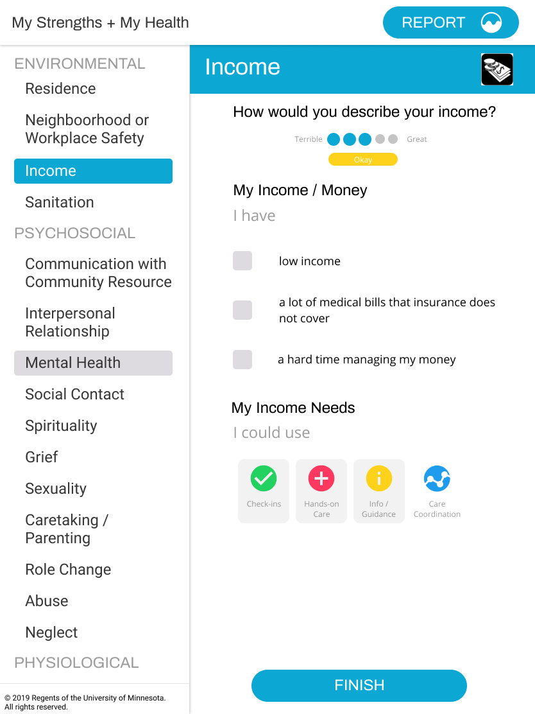
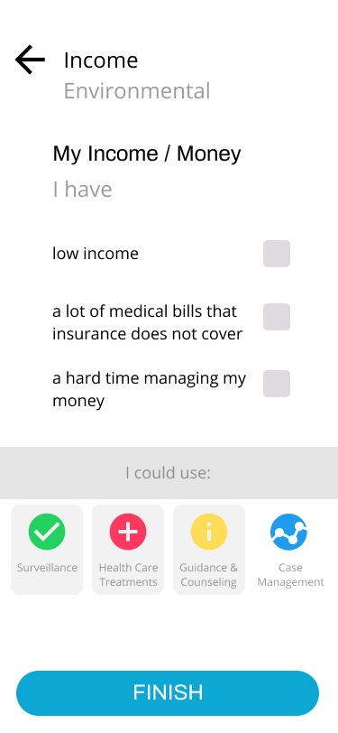
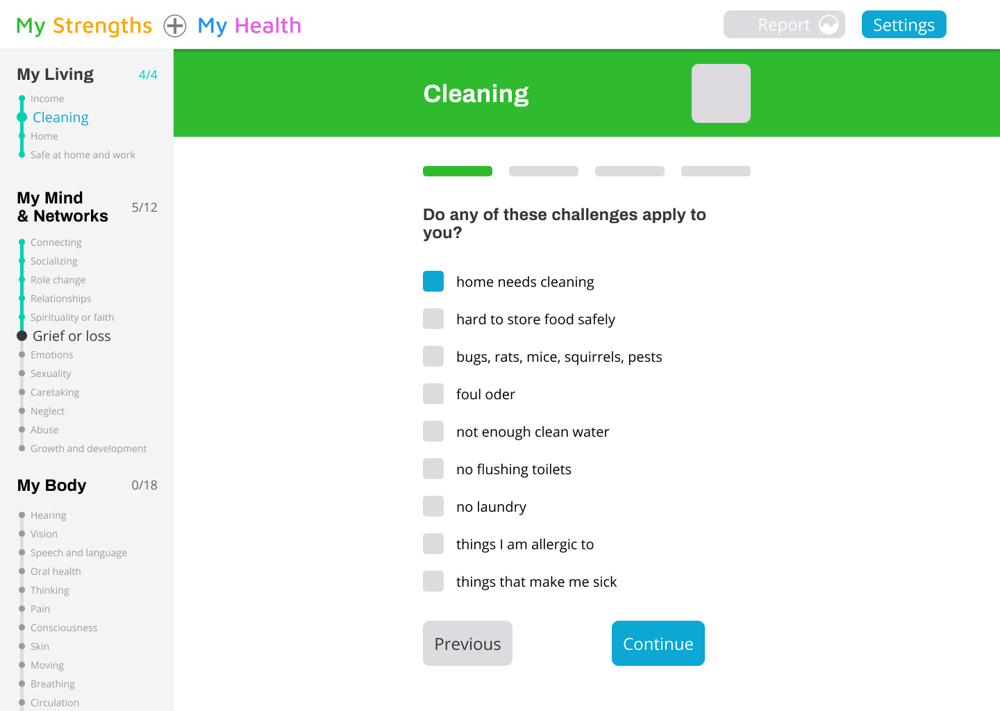
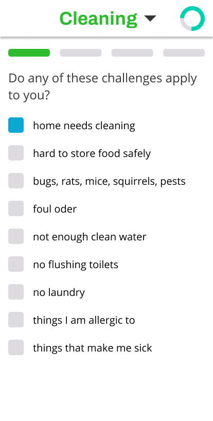
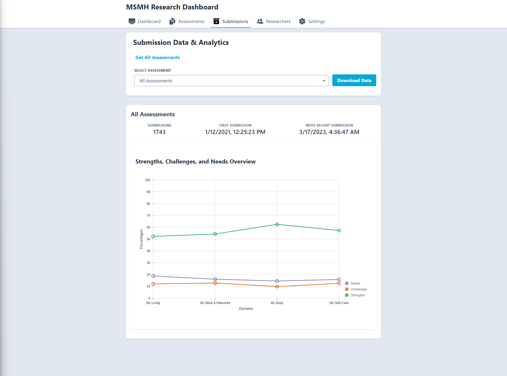

# My Strengths My Health

My Strengths My Health, or MSMH for short, is a research project at the University of Minnesota. The goal of this research project was to gather data on the determinants of health using a framework called the Omaha System as its foundation.

The head of the project had a simple software implementation of the Omaha System. This version of the system was built with Ruby on Rails by some students at the University of Minnesota. They quickly found they needed more functionality like localization and reporting. They were also running into some scaling issues with submission of health assessments in the current solution.

I joined the research project about 3/4 of the way through my Computer Science education at the University of Minnesota as the sole developer on the project. The previous students who developed the initial solution, onboarded me onto the current codebase. After digging in, decided to rewrite the solution from scratch in the stack I had more experience in, Node and React. I started by making an initial design in Figma and put a lot of focus into making an easy to use assessment format. I wanted to keep the user experience as simple as possible as the general demographic was all over the place in terms of age and education.

This is the main assessment flow of the first design I did:

I also made a design for the mobile format:

I went back to the heads of the research project and we iterated on these designs a bit until we decided they were solid enough to start building the actual software. I communicated a general plan and timelines to them in a work plan document. Keep in mind, I would consider this my first real software project so naturally my timelines were way off as estimating software is and continues to be one of the hardest things to do for me.

I broke the project up into 4 different components:

- A core service (Node API) that serves as the API to a software version of the Omaha system. This service exposed each health area and their domains as well as all question options underneath them. This service also handled localization of each question by using a database schema that supported dynamically pulling questions based on the localization passed into the header on http request.
- A vendor service (Node API) that handled management of researcher accounts and the viewing and management of all assessment submissions and results. Researchers all over the world created their own personalized assessments through this system. This service also handled some over-time analytical workflows.
- Assessment UI (React UI) which is the public facing interface for completing assessments. This interface guided a user through the assessment and saved progress to local storage along the way (this protected against losing progress in the event of a page refresh or even the browser closing). At the end of each assessment there was also a basic report page that displayed some basic results of the assessment. Code splitting was used based on screen size to serve either the desktop or mobile version of the app.
- Vendor UI (React UI) exposes authentication and password reset workflows for researchers, creating new assessments, customizing demographic and omaha questions to include, viewing and downloading submission results.

If I remember correctly, I built the first version of this system in about 4-6 months and the second version in about 7 months.

The latest version of the assessment application looks something like this:

Here is a screenshot from the researcher dashboard:

I learned a ton about building software with web technologies getting into topics like:

- Docker
- API Development
- General Node and TypeScript development
- React and form design
- UI/UX design
- Monitoring and alerting solutions
- Working with non-technical stakeholders on setting expectations and timelines
- Data visualization and dashboards
- And much more...

I think this project taught me a lot more about practical software engineering than my computer science degree did. Doing a project like this alongside traditional compsci education curriculums and internships should be a requirement in my opinion. I think having this opportunity and seeing it through to completion put me ahead of many of my peers coming out of college. I believe I was able to contribute faster when entering the actual workforce. I am grateful I was given the opportunity to do this project on top of my studies.

As of today, the project requires very little maintenance but is being used by researchers all over the world. The app has support for around 10 languages currently. The research project is still on-going but currently seeking funding for a larger development team to keep adding features.
