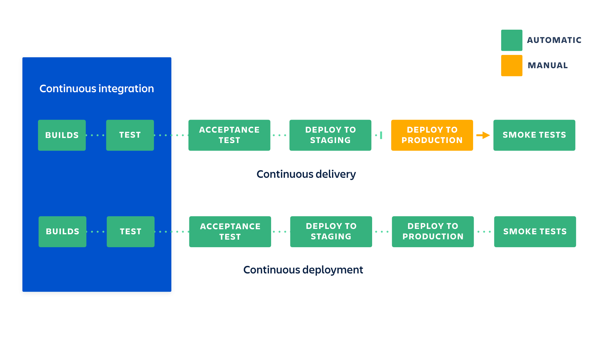
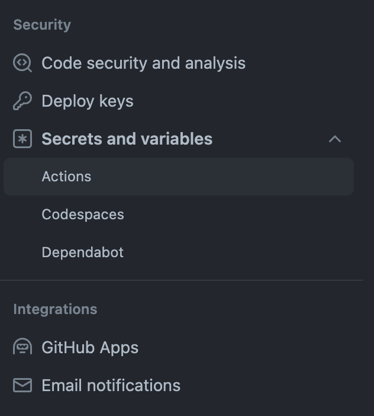
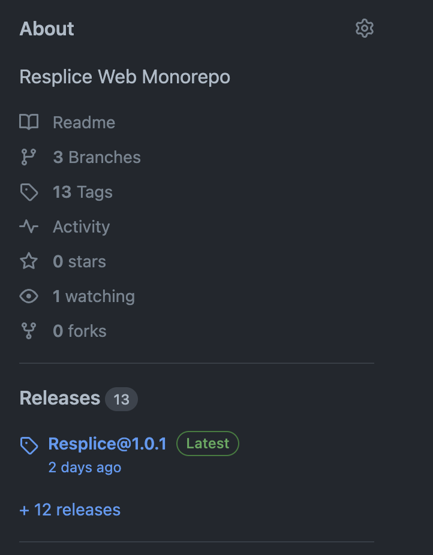

# Deployment Strategy for Web Apps

So you've finally built the thing but now you might be thinking to yourself, "How do I deploy this thing"? That question gets even more complicated when you throw in all the requirements of modern continuous integration and delivery. Complexity grows even more when coordination across people or full teams needs to be managed in your deployment strategy. In this post, I will outline one of my favorite deployment strategies that you can set up right away and still have it scale to multiple team members or even across a few teams.

## What is CI/CD?

Continuous integration (CI) & continuous delivery/deployment (CD) are terms that are thrown around a lot when talking about deploying software. They describe the cycle of writing code, integrating that code into the codebase, usually with automation, and then deploying that code to an environment. Ideally, you want to make small, continuous improvements to your software and get those changes out to your users often and as fast as possible. CI/CD is a crucial system needed to meet this deployment goal. So what exactly is this system and how do we build it?

### Continuous Integration

Continuous integration, or CI, is the practice of integrating any code changes into the trunk or main branch of your code repository and then automating the testing, linting, style checks, and new build of those code changes. With this system in place, you can automatically detect errors and other issues that arise from your code changes much earlier in the development process. If you merge your changes often you also reduce the amount of code conflict that arises and this usually results in smaller pull requests and higher quality code reviews.

### Continuous Delivery

Continuous delivery, or CD, is the practice of automating infrastructure provisioning, packaging, and deployment of an application to a testing environment, usually after it goes through a CI layer. DevOps and DevEx teams usually gate this CD process with some requirements like code coverage must be over 80% or the Docker container must have no critical security warnings from a container scan for example. At the end of this process, the team should be able to deploy the software changes to production quickly and easily. Ideally, this is done with a single button click after some manual testing and QA of the change in the test environment.

### Continuous Deployment

There is a second term for CD called continuous deployment. I like to think of continuous deployment as the more mature version of continuous delivery because this process automates the release and deployment of the changes into the production environment and into the user's hands. If this is implemented correctly, a code change can be merged and then go live within a few minutes, allowing you to gather feedback and iterate quickly. Implementing continuous deployment does require more upfront investment, especially in your unit and end-to-end test suites, to ensure you do not accidentally push breaking changes to production.

The difference between continuous delivery and continuous deployment will be much more clear after our implementation. Atlassian has a great diagram showing the differences and how they relate to CI:



While you can have CI without CD, having CD without CI is generally not recommended as it is dangerous to release an untested application into production.

## Implementation

[TLDR; just show me the code](https://github.com/MarcusVirg/sandbox/tree/main/concepts/ci-cd-fe)

Now that we have a better idea of what some of these terms mean, let's go through an implementation of a CI/CD pipeline. This guide will not go through an implementation of continuous deployment as it can be implemented fairly easily after continuous integration and continuous delivery and is usually reserved for applications that have robust controls in place. This guide will show a simple setup for doing a manual production release after continuous delivery. Unless you are one of those TDD tryhards that ship with a 99% code coverage test suite, I recommend you use a manual production release process until you have built up your own comprehensive test suite.

This guide will use an example front-end application and show you how to create a CI/CD process that deploys to [Vercel](https://vercel.com/home).

> Note: I am assuming you already have Node installed and a development environment setup. If that isn't the case, please take time to do that now.

### Tools

There are many CI/CD tools out there that provide a platform to help integrate and deploy code changes. Some examples include:

- GitLab CI/CD
- GitHub Actions
- Jenkins
- CircleCI
- TravisCI
- Azure Pipelines
- and many more

They all have their pros and cons but I personally just go with GitHub actions and recommend you do the same. You are likely already using GitHub and they have a **very** generous free tier. The integration is better with your existing codebase and the community is already large so there is a ton of resources out there to learn about how it works. If you are using GitLab, I would recommend going with the GitLab CI/CD naturally.

If you work at a company, especially a large corporation, you likely have already had this decided for you. This guide should still be useful to you either way. You will either learn more about how your existing CI/CD works or will be able to take this GitHub actions example and duplicate the functionality in your tool of choice.

You will also need some tools adjacent to your CI/CD platform so you can build, test, and deploy your software. Your CI/CD won't do this for you, it simply runs tools to do all those things in an automated fashion.

Here are some examples of modern web build tools:

- [Webpack](https://webpack.js.org/)
- [Vite](https://vitejs.dev/)
- [Rollup](https://rollupjs.org/)
- [ESBuild](https://esbuild.github.io/)
- [Turborepo](https://turbo.build/)
- [Grunt](https://gruntjs.com/)
- [Parcel](https://parceljs.org/)

Here are some examples of modern web testing tools:

- [Jest](https://jestjs.io/)
- [Vitest](https://vitest.dev/)
- [Playwright](https://playwright.dev/)

Finally, here are some examples of modern web linting tools:

- [ESLint](https://eslint.org/)
- [TypeScript](https://www.typescriptlang.org/) (Typed JS, more than just a linter)
- [Prettier](https://prettier.io/) (Code Formatting)

In this guide, we will be using the following tools:

- Vite & Rollup for production bundling
- Vitest for testing
- ESLint & Prettier
- TypeScript

These tools will cover the building and testing of our application but what about deployment? We need some kind of system or platform that will take our final production bundle and serve those static files, or if we are using a server-rendered application, a system that runs a node server. That system should also handle DNS for us and point a URL at our application (ideally with SSL already set up). This is where Vercel comes in. They are a great platform for deploying static sites and SSR web applications. We will be using their CLI tool combined with GitHub Actions to deploy the application in the CD step.

### Setup

Let's quickly set up a React single-page application using Vite so we have a project to test our CI/CD with.

> If you already have an existing project, please skip this step and go to [CI](#ci-action).

#### Vite CLI

Run:

```sh
npm create vite@latest
```

Enter a project name, select `React` as the framework, select `TypeScript` as the variant, and then hit enter to create the project. Following the instructions the CLI gives you and `cd` into your project folder and run `npm install`. This will install the dependencies you need to run a basic React app. Using the `Vite` CLI, we get some things for free. ESLint & TypeScript has already been installed and configured for us. To finish setup, we will just need to install and configure `Prettier` & `Vitest`.

#### Prettier

To set up Prettier, run:

```sh
npm install --save-dev prettier eslint-config-prettier
```

Add the prettier plugin to the eslint `extends` config that vite created for us in the `.eslintrc.cjs` file:

```js
extends: [
  'eslint:recommended',
  'plugin:@typescript-eslint/recommended',
  'plugin:react-hooks/recommended',
  'prettier'
],
```

It's also worth adding a `.prettierrc` to configure prettier to your liking here is an example:

```json
{
  "useTabs": true,
  "tabWidth": 2,
  "semi": false,
  "singleQuote": true,
  "trailingComma": "none",
  "printWidth": 100
}
```

Finally, change the `lint` command in `package.json` to `eslint . --ext ts,tsx --report-unused-disable-directives --max-warnings 0 && prettier --check src`.

This will run eslint and prettier in the CI later on.

> Make sure to run this command locally now and fix any errors otherwise it will break CI later on.

#### Vitest

To install `vitest` run:

```sh
npm install --save-dev vitest jsdom @testing-library/react @testing-library/jest-dom
```

Change your existing `vite.config.ts` file to be:

```ts
/// <reference types="vitest" />
import { defineConfig } from 'vite'
import react from '@vitejs/plugin-react'

// https://vitejs.dev/config/
export default defineConfig({
  plugins: [react()],
  test: {
    environment: 'jsdom',
    setupFiles: ['./setupTests.ts']
  }
})
```

Finally, create that `setupTests.ts` file in the root directory and paste this in:

```ts
import '@testing-library/jest-dom/vitest'
```

and add this file to your `tsconfig.json` `include` property:

```json
"include": ["src", "setupTests.ts"],
```

That should be all you need to set up vitest. Let's write a small sample test to have our CI run at least one test.

Create a new file called `App.test.tsx` in the `src` directory.

> Make sure the extensions is `.tsx` not `.ts`

Paste the following in the new file:

```tsx
import { describe, test, expect } from 'vitest'
import App from './App'
import { render, screen } from '@testing-library/react'

describe('App Render', () => {
  test('should render the app', () => {
    render(<App />)
    expect(screen.getByAltText('Vite logo')).toBeInTheDocument()
    expect(screen.getByAltText('React logo')).toBeInTheDocument()
  })
})
```

This test just renders our `App` component and checks if the logos were rendered.

Create a new `test` script in your `package.json` file:

```json
"test": "vitest --run",
```

Run `npm run test` locally to verify the test passes.

This concludes the setup and we can now move on to the CI/CD implementation.

### GitHub Actions

GitHub Actions uses the concept of workflows to run automated tasks. In fact, Actions can be used to do more than CI/CD, like run jobs on issue creation or project events. We will just focus on using Actions for CI/CD today. I recommend you read over the [GitHub Actions Docs](https://docs.github.com/en/actions) after (or before) this tutorial to gain a better understanding of its components.

As I hinted at before, you can configure a GitHub Actions workflow to be triggered when an event occurs in your repository, like a pull request being opened or on a merge to main. Your workflow contains one or more jobs that can run in sequential order or in parallel. Each job will run inside its own virtual machine runner, or inside a container, and has one or more steps that either run a script that you define or run an action.

Workflows are defined in the `.github/workflows` folder checked into your repository. Repos can have many workflows in them. In our CI/CD setup, we will have four workflows. The first two will build and test our application and the other will deploy our application to Vercel. We are going to make these workflows reusable and reference them in our last two workflows. One will trigger just the CI workflow on a PR and the full workflow to the **preview** environment on merge to main. The other will trigger on a GitHub release and deploy the application to the production environment. With this setup, the only manual step is creating the GitHub release, and as I mentioned at the beginning of this guide, it is best to keep this manual for a while until you are confident to automate your production releases. Creating the GitHub release manually is also a good time to think about and create your changelog for that specific release.

> HINT: Eventually you can even create a GitHub action that creates a release for you with automated changelogs and other goodies.

#### CI Action

Let's start with the CI workflow. Create a new folder at the root of your repo called `.github/workflows`. Underneath that workflows folder, create a new file called `ci.yml`. Let's create a new workflow in this file. You can see the basic anatomy of a workflow [here.](https://docs.github.com/en/actions/using-workflows/about-workflows#create-an-example-workflow). First, we will give it a name and a trigger to run on.

```yml
name: Integration

on: workflow_call
```

You can trigger on [many different events](https://docs.github.com/en/actions/using-workflows/workflow-syntax-for-github-actions#on) inside your repository but in this case, we are going to call this workflow from another workflow so we trigger on the `workflow_call` event. You can name your workflow whatever you want but I will name this one `Integration`.

Now we have to tell the workflow which jobs to run:

```yml
name: Integration

on: workflow_call

jobs:
  integrate:
    runs-on: ubuntu-latest

    steps:
      - uses: actions/checkout@v3

      - name: Setup Node.js
        uses: actions/setup-node@v3
        with:
          node-version: 20
          cache: 'npm'
```

Here we will only run one job called integrate. You must tell each job where to run, in this case, we set the `runs-on` keyword to `ubuntu-latest`. This uses a Linux job runner hosted by GitHub.

> You can also set up [self-hosted](https://docs.github.com/en/actions/hosting-your-own-runners/managing-self-hosted-runners/about-self-hosted-runners) job runners if your company runs its own data center.

For this job, we will start with two steps. One to check out our repo and shallow clone our code, and another to set up a Node environment so we can run our Node-based build and testing tools. These steps have a `uses` keyword that seems to point to some directory structure (these are actually GitHub repos themselves). These are actions that GitHub has built in and they are very useful so use them if you can. Here is the [Checkout action](https://github.com/actions/checkout). See the [Actions organization](https://github.com/actions) for a full list. The `with` keyword in the `setup-node` step passes arguments to the action so it can use parameters to set up our preferred environment. In this case, I tell it to use Node version 20 and cache npm artifacts.

Now that we have our repo checked out and Node installed, we can run any commands we want. We want this workflow to build, lint, and test our application. We already have commands in our `package.json` file to do this so let's add them to our job:

```yml
name: Integration

on: workflow_call

jobs:
  integrate:
    runs-on: ubuntu-latest

    steps:
      - uses: actions/checkout@v3

      - name: Setup Node.js
        uses: actions/setup-node@v3
        with:
          node-version: 20
          cache: 'npm'

      - name: Install Dependencies
        run: npm ci

      - name: Lint App
        run: npm run lint

      - name: Build App
        run: npm run build

      - name: Test App
        run: npm run test
```

Again, you can name these steps whatever you want but these are the names I gave them. I would recommend running these locally, to make sure they at least work on your machine before having the CI run it. It's probably worth running them before any PR you make since we will run this workflow on every PR or push to an existing PR. Now that our CI is set up, we can move on to our CD workflow.

#### CD Action

Create a new file in the `.github/workflows` folder called `cd.yml`. We are also going to run this on the `workflow_call` event but this time we will define some inputs:

```yml
name: Deployment

on:
  workflow_call:
    inputs:
      environment:
        type: string
        required: true
    secrets:
      VERCEL_ORG_ID:
        required: true
      VERCEL_PROJECT_ID:
        required: true
      VERCEL_ACCESS_TOKEN:
        required: true
```

We need to know what environment this workflow will deploy to. We also define a list of secrets we need access to. Vercel's CLI requires some IDs and an access token to be able to deploy Vercel projects under your account. Learn about these Vercel variables [here](https://vercel.com/docs/deployments/configure-a-build#system-environment-variables). You will want to add them to your GitHub repo's secrets. You can find secrets in your repo's settings menu under the `security` section under `Actions`:



> Note: If you don't yet have a Vercel project, you can create one using the Vercel CLI: `vercel project add`. I don't usually give Vercel direct access to my repository code and use this GitHub actions setup instead.

The Vercel CLI requires these IDs to be environment variables on the runner. We can set ENV variables on the runner using the `environment` key:

```yml
name: Deployment

on:
  workflow_call:
    inputs:
      environment:
        type: string
        required: true
    secrets:
      VERCEL_ORG_ID:
        required: true
      VERCEL_PROJECT_ID:
        required: true
      VERCEL_ACCESS_TOKEN:
        required: true

env:
  VERCEL_ORG_ID: ${{ secrets.VERCEL_ORG_ID }}
  VERCEL_PROJECT_ID: ${{ secrets.VERCEL_PROJECT_ID }}
  APP_DOMAIN: app${{ inputs.environment == 'preview' && '-preview' || '' }}.marcusv.me
```

Take a look at the `APP_DOMAIN` variables. We can do some conditional logic based on our inputs into the action. If the environment is `preview`, we want to deploy the under the domain `app-preview.marcusv.me`. Other we will deploy it under `app.marcusv.me`. Please change these URLs to your desired app URLs. Don't forget to register a custom domain in the [Vercel Dashboard](https://vercel.com/docs/projects/domains/add-a-domain).

Now that we have all the required inputs we can add our `deploy` job:

```yml
name: Deployment

on:
  workflow_call:
    inputs:
      environment:
        type: string
        required: true
    secrets:
      VERCEL_ORG_ID:
        required: true
      VERCEL_PROJECT_ID:
        required: true
      VERCEL_ACCESS_TOKEN:
        required: true

env:
  VERCEL_ORG_ID: ${{ secrets.VERCEL_ORG_ID }}
  VERCEL_PROJECT_ID: ${{ secrets.VERCEL_PROJECT_ID }}
  APP_DOMAIN: app${{ inputs.environment == 'preview' && '-preview' || '' }}.marcusv.me

jobs:
  deploy:
    runs-on: ubuntu-latest

    steps:
      - uses: actions/checkout@v3

      - name: Setup Node.js
        uses: actions/setup-node@v3
        with:
          node-version: 20
          cache: 'npm'

      - name: Install Vercel CLI
        run: npm install --global vercel@latest

      - name: Pull Vercel Environment Information
        run: vercel pull --yes --environment=${{ inputs.environment }} --token=${{ secrets.VERCEL_ACCESS_TOKEN }}

      - name: Build Project Artifacts
        run: vercel build ${{ inputs.environment == 'production' && '--prod' || ''}} --token=${{ secrets.VERCEL_ACCESS_TOKEN }}

      - name: Deploy Project Artifacts to Vercel
        id: deployment
        run: echo "url=$(vercel deploy --prebuilt ${{ inputs.environment == 'production' && '--prod' || ''}} --token=${{ secrets.VERCEL_ACCESS_TOKEN }})" >> $GITHUB_OUTPUT

      - name: Deployment URL
        run: vercel alias set ${{ steps.deployment.outputs.url }} $APP_DOMAIN --token=${{ secrets.VERCEL_ACCESS_TOKEN }}
```

We check out our repo again and install Node just as before. Next, we need to install the Vercel CLI so we can run commands to deploy our projects.

I won't cover in detail how the Vercel CLI works but feel free to read the [CLI docs here](https://vercel.com/docs/cli). We first need to pull down all the secrets and other environment information from Vercel using the `pull` command. Each Vercel command needs to be passed a token, which you can create via the Vercel dashboard, that gives the CLI access to your account and projects. Next, we can run `vercel build` which builds the project locally with the pulled secrets. Again we can conditionally check our input to pass the `--prod` flag to vercel build. This flag tells Vercel to build a production version of our application.

In this next step we give an ID of `deployment` and do something weird in the `run` key. We want to save the result of the `vercel deploy` command and use it in the next step and this is the GitHub Actions way of doing that. It looks gross I know but we will walk through it. Staring with the inner-most part, `vercel deploy` is called with the `--prebuilt` flag (because we already built in the previous step) and another conditionally rendered `--prod` flag. This command will trigger Vercel to deploy our app but we nest that command in this weird `url=$(..)` thing. Appending this to `$GITHUB_OUTPUT` actually sets a variable in the next step that we can access through `steps.deployment.outputs.url`. This is a `context` that we have access to inside of an expression. Don't worry, this is all documented in the [GitHub Actions docs](https://docs.github.com/en/actions/learn-github-actions/contexts) if you want to know more.

Finally, our last command uses the output from the `vercel deploy` command and sets up our custom domain to point at the new deployment. `$APP_DOMAIN` in that command resolves to the value in the `env` key early on in this file. That should be all we need to deploy our app with Vercel. Easy right?? Un-sarcastically this was actually the hardest part of our CI/CD setup.

Currently these workflows never get triggered. So let's quickly write the last two workflows that call the workflows we just created.

#### CI/CD Action

Create a new file called `ci-cd.yml` under the `.github/workflows` folder. Give it a name and define the `on` key:

```yml
name: CI/CD

on:
  push:
    branches:
      - 'main'
  pull_request:
    branches:
      - 'main'
```

This time we want to trigger the workflow on actual GitHub repository events. Anytime a push **or** a PR to `main` happens we want this workflow to trigger.

Now to define the jobs:

```yml
name: CI/CD

on:
  push:
    branches:
      - 'main'
  pull_request:
    branches:
      - 'main'

jobs:
  ci:
    uses: ./.github/workflows/ci.yml
```

Our first job definition is easy because we can just call the `ci.yml` workflow directly. Notice how this is very similar to calling a built-in action with the `uses` keyword. This time we use a relative link to point to our own workflow at `./.github/workflows/ci.yml`. This will handle the PR case. Our next job definition is a little more tricky because we only want it to run on a push to main. We can do this with the `if` key:

```yml
name: CI/CD

on:
  push:
    branches:
      - 'main'
  pull_request:
    branches:
      - 'main'

jobs:
  ci:
    uses: ./.github/workflows/ci.yml

  cd:
    if: ${{ github.event_name == 'push' }}
    needs: ci
    uses: ./.github/workflows/cd.yml
    with:
      environment: preview
    secrets:
      VERCEL_ORG_ID: ${{ secrets.VERCEL_ORG_ID }}
      VERCEL_PROJECT_ID: ${{ secrets.VERCEL_PROJECT_ID }}
      VERCEL_ACCESS_TOKEN: ${{ secrets.VERCEL_ACCESS_TOKEN }}
```

For our CD job, we check to see if the `event_name` is `push`. If the event_name is anything else, it will skip this job during the workflow run. We also define a `needs` keyword. This creates a dependency between this step and the previous step (I believe this is by default setup but I like to define the dependency directly.) This means that the CI step needs to pass successfully for this step to run. We don't want broken code to ever be deployed. We can also use the `with` key to populate our `inputs` in our `cd` workflow. We also pass which secrets this workflow has access to. The `uses` key is doing a `workflow_call`. We now have a workflow setup that runs on a PR or merge to `main` that calls our two different workflows.

At this point, it's worth testing this out to make sure you can deploy into your preview environment. Make sure you have your Vercel project set up correctly and that all your required secrets have been added. If you have any issues please comment on this blog post or reach out directly to me via [email](/about).

#### Release Action

If you were able to deploy to your preview environment, you can move on to the final step, the big release! Define one more file in the `.github/workflows` called `release.yml`:

```yml
name: Release

on:
  release:
    types: [published]
```

This time we only want to trigger on a published release. You can create a GitHub release by clicking the releases header on the right side of the repo's homepage on GitHub.com:



At the top, there is a button that says `Draft a new release`. Here you can choose a tag, name the release, and list the changes this release has in markdown format. When you are finished click the button that says `Publish release` at the bottom. Doing this will trigger your workflow to run. Because this is a manual process, it gives you time to test your application first (manually or automated) inside of your preview environment. Your preview environment should really be a **prod** clone, meaning it should use the exact same infrastructure setup as the production environment would. The only difference between your preview and production environment is the data inside of it. I would attempt to mimic what production data might look like in your preview environment so you can cover real-world use cases but avoid straight copying production data into your preview environment. I have seen companies do this and it causes major privacy and data integrity issues. The exception to this rule would be if the data inside your application is all public anyways and **not** personally identifiable information (PII).

Okay moving onto the job for this `Release` workflow. As you might have guessed, the job setup for this workflow is going to be very similar to the previous `CI/CD` job:

```yml
name: Release

on:
  release:
    types: [published]

jobs:
  ci:
    uses: ./.github/workflows/ci.yml

  cd:
    needs: ci
    uses: ./.github/workflows/cd.yml
    with:
      environment: production
    secrets:
      VERCEL_ORG_ID: ${{ secrets.VERCEL_ORG_ID }}
      VERCEL_PROJECT_ID: ${{ secrets.VERCEL_PROJECT_ID }}
      VERCEL_ACCESS_TOKEN: ${{ secrets.VERCEL_ACCESS_TOKEN }}
```

The only big difference is that we

1. Trigger on a published release
2. Remove our `if` key from the `cd` job because we know we want to deploy every time
3. Our `environment` input is now set to `production`

You might ask, "Why do we need to run our `ci` job again?". Good question because in theory, our `CI` job should have run on our PR to `main` and again when we did our final push to `main`. In practice, this is not always guaranteed. Engineers on your teams might end up force pushing to `main` or completely bypass the action that gets run on PRs or during a push to `main`. It is always safer to run the `CI` one additional time right before a release to ensure you are not releasing broken code to production.

And that's it. You should now have a working CI/CD to run for your web applications or any other piece of software.

## What's Next?

This basic CI/CD setup should be enough to get you started. You can even copy this same structure for your backend applications as well, as it should work about the same especially if your backend is in `Node` as well.

Some improvements can be made to this setup though:

### E2E & Smoke Tests

Eventually, you will want to run E2E tests and smoke tests against a passive URL, a URL that is accessible but not yet live to your users. You can use GitHub actions to deploy with Vercel and then use that URL saved in the step variable to run your E2E and smoke tests against. If these tests pass, you could then do the final `vercel alias` command to make that passive url live. Doing this will ensure all your happy paths work in production. I highly recommend writing your E2E tests with [Playwright](https://playwright.dev/).

### Automated Release

As I mentioned before, once you are confident in your test suite of unit, integration, and E2E testing, you can begin to automate the release process. This could also be done with GitHub actions. The basic concept would be to deploy to your preview environment and run your E2E tests against it. If those tests pass it is *probably* safe to release and deploy into production automatically.

The easiest way to do this would be to keep your release job as it is but automate the release creation process in GitHub. Doing this will require a way to automate your changelogs. There are many tools to do this but one that seems popular is [changesets](https://github.com/changesets/changesets) if you are in a monorepo or [conventional changelog](https://github.com/conventional-changelog/conventional-changelog) if you want something simpler. Automated changelogs are always better if you are disciplined in your commit messages. Some pre-commit tooling like [Husky](https://github.com/typicode/husky) and [Convential Commits](https://www.conventionalcommits.org/en/v1.0.0/).

### Monorepos

Speaking of monorepos, this current CI/CD implementation will not work if you have multiple applications in the same repo but you can solve this with some small tweaking. I would recommend creating a workflow for each application in your repo and triggering that workflow based on files changed in the latest commit. It could look something like this:

```yml
name: App1 CI/CD

on:
  push:
    branches:
      - 'main'
    paths:
      - apps/app1/**
  pull_request:
    branches:
      - 'main'
    paths:
      - apps/app1/**
```

You can tell GitHub to trigger on a push or PR but only if the files changed were inside that path. This will allow you to run jobs for specific applications only with the correct folder structure.

You can then add an `app_name` input to your `ci.yml` and `cd.yml` workflows that would conditionally run commands for just that specific application.

If you are curious to learn more, comment on this post or DM me directly.

## Conclusion

I hope this guide helped you get started with your CI/CD.

Let me know if you think I missed something or want to dive deeper into a certain topic.

If you liked this content please check out my other [blog posts](https://marcusv.me/blog/) and subscribe to my [RSS feed](https://marcusv.me/rss.xml).

I am also active on [Mastodon](https://mastodon.social/@marcusvirginia).
