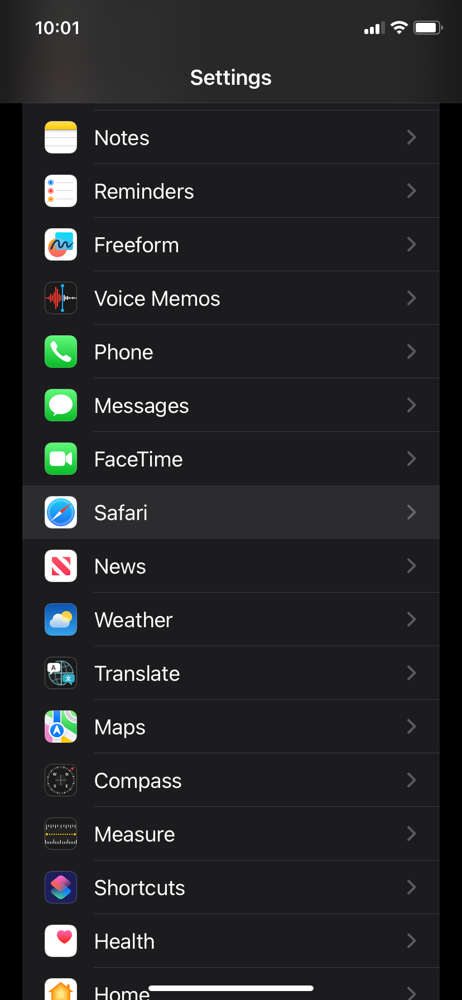
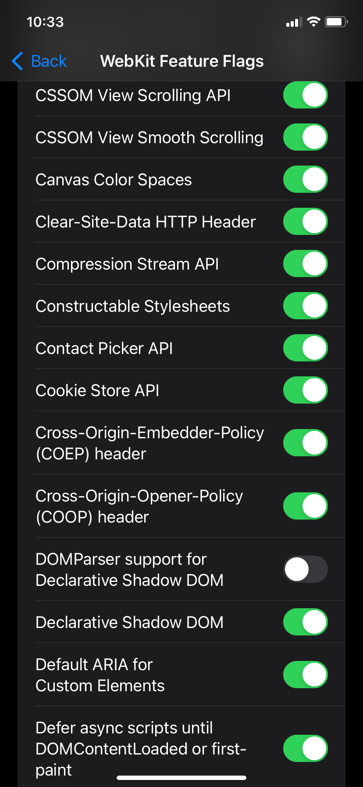

# Interacting with Contacts on the Web

If you are a Safari user please continue reading the guide below. If you are a developer [start here](#contact-picker-api).

## Enable the Contact Picker in Safari iOS

In April 2021, Safari added the ability for a web app to select and read native contacts. However, this feature is hidden behind a flag which means your favorite web apps can't live up to their full potential.

As we close out of 2023, this feature is still hidden. Apple is probably working through some security stuff with this API as usual or its just not a priority for them (more likely). The good news is turning this feature on in Safari is pretty simple so lets walk through that now.

First open up your iPhone, go to settings, and click on Safari:



Scroll to the very bottom and tap `Advanced`. In the `Advanced` settings, scroll to the bottom again and tap `Feature Flags`.

You should now see many different settings wih the ability to switch them on and off. Scroll down to the setting called `Contact Picker API`:



Flip that switch like you're turning on the disco lights, and voila, the contact picker should work! 🎉

Now, if this upcoming developer lingo makes your eyes glaze over faster than a Dunkin donut, feel free to exit stage left. Otherwise, continue reading for some goodies.

## Contact Picker API

Accessing a user's contacts has been made available to Native applications for years. With the release of the [contact picker spec](https://w3c.github.io/contact-picker/) spec, this is now possible in Web Applications!

This API gives one-off access to a user's contact information. As of 2023, the spec only includes reading contacts but I am hoping they expand this in the future to eventually give write or sync access as well.

This API has many use cases like selecting a contact to import into the application, selecting a contact to message or email, or for discovering existing contacts in a system.

Browser support is lacking as of 2023. Only Chrome on Android has this feature enabled by default. Safari on iOS can be enabled as shown in the user guide above. Check [MDN's compatibility table](https://developer.mozilla.org/en-US/docs/Web/API/Contact_Picker_API#browser_compatibility) for more details.

### Contact Picker Interface

The `Contact Picker API` currently has one main interface called `ContactsManager`.

> TIP: Remember to be as progressive as possible and check if this api is available in the browser before showing the option to the user: `const isSupported = 'contacts' in navigator && 'ContactsManager' in window`

This interface has one main function called `select` that returns a Promise with an array of contact results. This function takes a list of contact properties as it's first argument and some options as it's second argument. Here is an example:

```ts
const contactResults = await navigator.contacts.select(['icon', 'name', 'email', 'tel'], { multiple: true })
```

If we were to create a TS type for `contactResults` it would look something like:

```ts
type Contact = {
  icon: Blob
  name: string[]
  email: string[]
  tel: string[]
}
```

All possible property options at the time of this writing are:

1. `address`
2. `email`
3. `icon`
4. `name`
5. `tel`

See the [spec](https://w3c.github.io/contact-picker/#enumdef-contactproperty) for an updated list.

The only option for the second argument in the `select` function at the time of this writing is the boolean `multiple`. Setting `multiple` to true will change the behavior of the native UI and allow the user to select multiple contacts vs just selecting one.

You can select all properties supported by the current user agent with code like this:

```ts
const supportedProperties = await navigator.contacts.getProperties()
const contactResults = await navigator.contacts.select(supportedProperties, { multiple: true })
console.log(contactResults)
```

The property names are straight forward aside from the `icon` property. This property refers to an avatar or profile image that might be assigned to a contact. As shown above, this property is of type Blob.

If you want to display this property on an `img` tag, create a local url with `URL.createObjectURL()`. You can pass the result to the `src` attribute. Here is an example in Svelte:

```svelte
{#each contactResults as contact}
  <div>
    {#if contact.icon}
      
    {/if}
    <p>{contact.name[0]}</p>
  </div>
{/each}
```

Those are the basics to using this API as there isn't much to it yet. Now go out and try it today in your web apps on iOS and Android!

### Bonus: Adapter Pattern

You may be using this API in some import contacts flow alongside providers like Google or Microsoft. If this sounds like you, may I recommend reaching into your bag of patterns and pulling out the adapter?

Create a thin mapping interface between these contact providers and your application.
